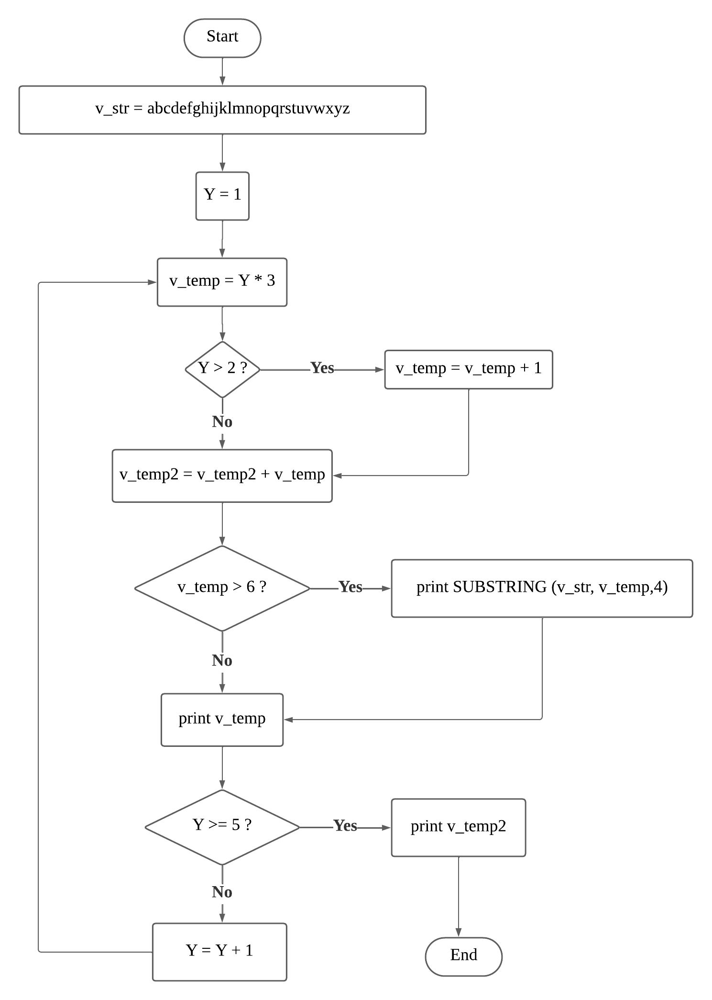

`code segment`

```
grep
find
make
```

|Name| Extension| Function|
|----|-------|------|
|Markdown|.md|Documentation|
|Text|.txt|Text Editing|
|Portable Document Format|.pdf|Illustrated documents|


<table style="color:blue;text-align:center">
  <tr>
    <th>Name</th>
    <th>ID</th>
  </tr>
  <tr>
    <td>Mr .T</td>
    <td>192034</td>
  </tr>
  <tr>
    <td>Mr. J</td>
    <td>198095</td>
  </tr>
</table>


[markdown doc link](https://www.markdownguide.org/basic-syntax/)


